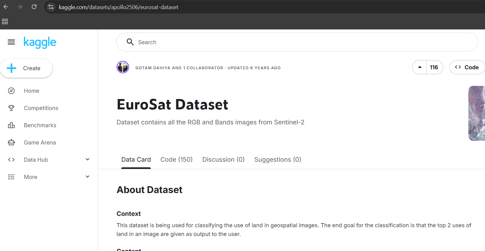
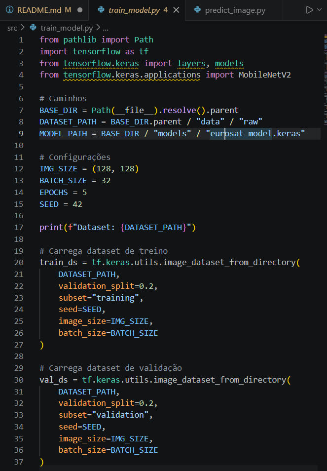
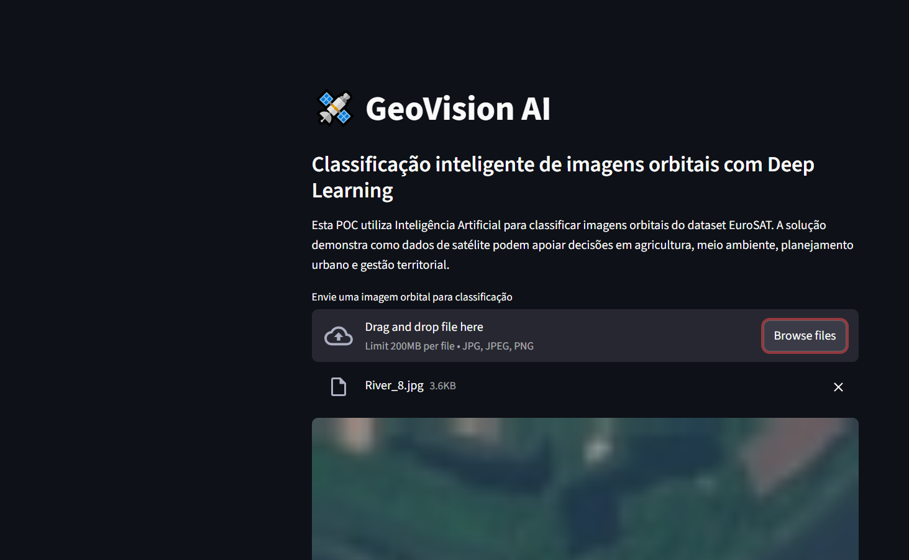
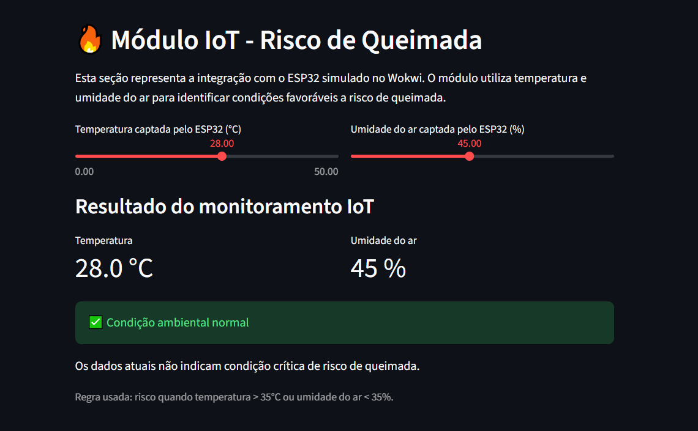
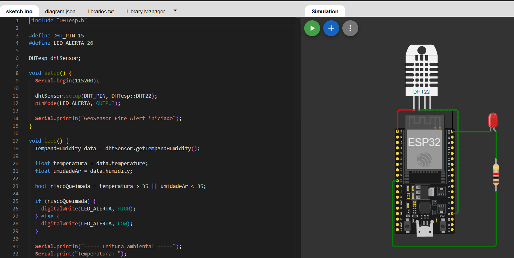
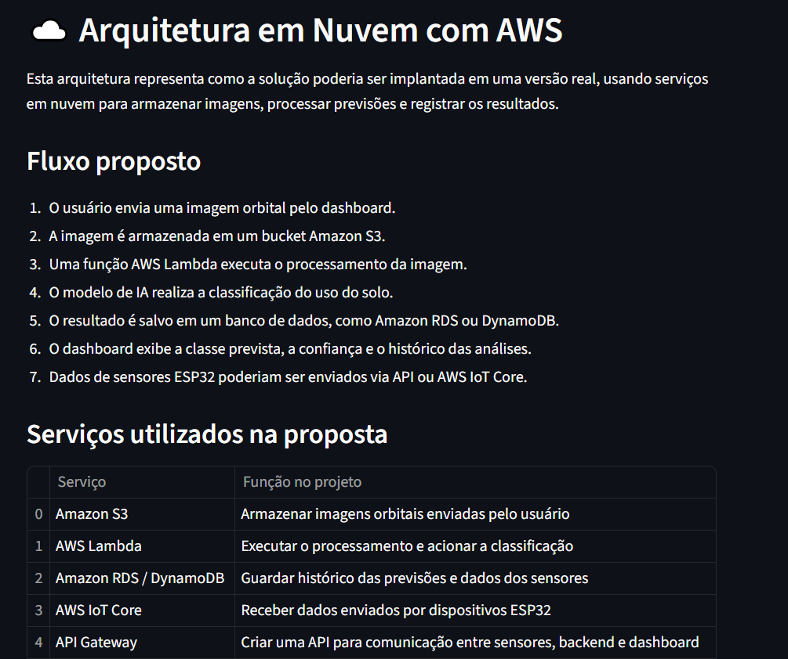

# FIAP - Faculdade de Informática e Administração Paulista

<p align="center">
  <a href="https://www.fiap.com.br/">
    
  </a>
</p>

<br>

# GeoVision AI - Classificação de Imagens Orbitais e Alerta IoT de Queimadas

## Nome do projeto

GeoVision AI - Projeto individual SUB Global Solution 2026.1

## 👨‍🎓 Integrante

- Tales Ferraz de Arruda Domienikan (RM567483)

## 👩‍🏫 Professores

### Tutor(a)

- Ana Cristina dos Santos

### Coordenador(a)

- André Godoi Chiovato

---

## 📜 Descrição

O projeto **GeoVision AI** foi desenvolvido como uma Prova de Conceito para a Global Solution 2026.1 - Space Connect. A proposta responde ao desafio: **como a Inteligência Artificial e as tecnologias digitais podem transformar a nova economia espacial e gerar impacto positivo na Terra?**

A solução utiliza imagens orbitais do dataset **EuroSAT**, baseado em imagens do satélite Sentinel-2, para classificar automaticamente diferentes tipos de uso e cobertura do solo. O modelo de visão computacional identifica categorias como áreas agrícolas, florestas, rios, regiões residenciais, áreas industriais, rodovias, pastagens e lagos.

A ideia central é demonstrar como dados espaciais podem ser interpretados com Inteligência Artificial para apoiar decisões em áreas como monitoramento ambiental, agricultura, planejamento urbano e prevenção de riscos. Esse tipo de solução pode ajudar governos, produtores rurais, centros de pesquisa e empresas a compreender melhor o território e agir de forma mais rápida diante de mudanças ambientais.

Além do modelo de IA, o projeto também possui um dashboard desenvolvido em **Streamlit**, onde o usuário pode enviar uma imagem orbital, visualizar a classe prevista, conferir a confiança do modelo e consultar o histórico de classificações salvo em banco de dados local.

Como complemento à análise espacial, foi criado um módulo IoT no **Wokwi**, utilizando **ESP32**, sensor **DHT22** e LED de alerta. Esse módulo simula um sistema de monitoramento de risco de queimadas, analisando temperatura e umidade do ar. Quando as condições indicam risco, o LED vermelho é acionado. A proposta mostra como sensores terrestres poderiam complementar dados orbitais em um sistema real de monitoramento ambiental.

A POC foi executada localmente para reduzir complexidade e evitar custos de implantação em nuvem. Como evolução futura, a solução poderia ser integrada a serviços de cloud computing, como Amazon S3, AWS Lambda, API Gateway, DynamoDB e AWS IoT Core.

---

## 🎯 Objetivo do projeto

Desenvolver uma solução tecnológica conectada à economia espacial, utilizando Inteligência Artificial, visão computacional, dashboard, banco de dados e simulação IoT para gerar impacto positivo na Terra.

### Objetivos específicos

- Classificar imagens orbitais em diferentes tipos de uso e cobertura do solo.
- Demonstrar o uso de Deep Learning aplicado a dados espaciais.
- Criar um dashboard interativo para upload e análise de imagens.
- Registrar o histórico de classificações em banco SQLite.
- Simular um módulo ESP32 no Wokwi para alerta de risco de queimada.
- Propor uma arquitetura futura com computação em nuvem.

---

## 🧠 Tecnologias utilizadas

- Python
- TensorFlow / Keras
- MobileNetV2
- Streamlit
- NumPy
- Pandas
- Pillow
- Matplotlib
- SQLite
- Wokwi
- ESP32
- Sensor DHT22
- Dataset EuroSAT

---

## 🛰️ Dataset utilizado

O dataset utilizado foi o **EuroSAT**:



 Esse dataset é composto por imagens orbitais de uso e cobertura do solo. As imagens são divididas em 10 classes:

- AnnualCrop
- Forest
- HerbaceousVegetation
- Highway
- Industrial
- Pasture
- PermanentCrop
- Residential
- River
- SeaLake

O modelo foi treinado para receber uma imagem orbital e prever automaticamente a classe mais provável.

---

## 🤖 Modelo de Inteligência Artificial

Foi utilizado **Transfer Learning** com a arquitetura **MobileNetV2**, uma rede neural convolucional pré-treinada.



### Configurações principais

- Tamanho das imagens: 128x128 pixels
- Divisão dos dados: 80% treino e 20% validação
- Épocas de treinamento: 5
- Otimizador: Adam
- Função de perda: Sparse Categorical Crossentropy
- Métrica: Accuracy

### Resultado obtido

O modelo alcançou aproximadamente **89,7% de acurácia na validação**, demonstrando boa capacidade inicial de classificação das imagens orbitais.

Em um teste simples com uma imagem de cada classe, o modelo acertou 9 de 10 categorias. A classe `River` foi confundida com `PermanentCrop`, o que indica que algumas imagens podem apresentar semelhanças visuais dependendo do recorte analisado.

---

## 🌐 Dashboard



O dashboard foi desenvolvido com **Streamlit** e permite:

- Enviar uma imagem orbital.
- Visualizar a imagem enviada.
- Exibir a classe prevista pelo modelo.
- Mostrar a confiança da previsão.
- Mostrar as 3 classes mais prováveis.
- Exibir gráfico de probabilidades por classe.
- Registrar o resultado em banco de dados SQLite.
- Consultar o histórico de classificações.
- Simular a integração IoT de risco de queimadas.
- Apresentar uma proposta de arquitetura em nuvem.

---

## 🔥 Módulo IoT - Wokwi



O módulo IoT foi criado no **Wokwi** usando ESP32.

### Componentes utilizados

- ESP32
- Sensor DHT22
- LED vermelho
- Resistor

### Funcionamento

O ESP32 realiza a leitura de:

- Temperatura do ar
- Umidade do ar

A lógica de risco de queimada considera:

- Temperatura maior que 35°C
- Ou umidade do ar menor que 35%

Quando uma dessas condições ocorre, o LED vermelho é acionado, representando um alerta visual de risco ambiental.



Esse módulo representa sensores terrestres que poderiam ser instalados em áreas monitoradas. Em um sistema real, esses dados poderiam ser enviados para o dashboard por API, MQTT ou AWS IoT Core.

---

## ☁️ Arquitetura proposta em nuvem



Nesta POC, a solução roda localmente. Porém, para uma versão real, a arquitetura poderia utilizar serviços em nuvem:

| Serviço | Função |
|---|---|
| Amazon S3 | Armazenar imagens orbitais enviadas pelo usuário |
| AWS Lambda | Executar processamento e classificação das imagens |
| API Gateway | Criar comunicação entre dashboard, backend e sensores |
| DynamoDB ou RDS | Salvar histórico de previsões e leituras dos sensores |
| AWS IoT Core | Receber dados enviados por dispositivos ESP32 |
| Streamlit | Exibir dashboard, resultados, gráficos e alertas |

Essa arquitetura permitiria escalar a solução e integrar dados orbitais, sensores terrestres e modelos de IA em uma plataforma única.

---

## 📁 Estrutura de pastas

Dentre os arquivos e pastas presentes no projeto, definem-se:

- **assets**: Contém recursos visuais utilizados no README e na documentação.
  - **logo-fiap.png**: Logo da FIAP utilizada no cabeçalho do README.

- **data**: Contém o dataset utilizado no projeto.
  - **raw**: Contém as imagens originais do EuroSAT, separadas por classe.

- **docs**: Pasta destinada à documentação do projeto.
  - Contém prints do dashboard, imagens de resultados, diagramas e materiais usados no PDF final.

- **src**: Contém todo o código-fonte da aplicação.
  - **app.py**: Aplicação principal em Streamlit.
  - **check_dataset.py**: Script para verificar se o dataset está organizado corretamente.
  - **visualize_dataset.py**: Script para visualizar exemplos das classes do dataset.
  - **train_model.py**: Script de treinamento do modelo.
  - **predict_image.py**: Script para testar previsão individual.
  - **test_all_classes.py**: Script para testar uma imagem por classe.
  - **generate_results_chart.py**: Script para gerar gráfico de confiança.
  - **database.py**: Script responsável pelo banco SQLite.
  - **requirements.txt**: Lista de dependências necessárias para executar o projeto.
  - **models**: Pasta onde o modelo treinado é salvo.
  - **outputs**: Pasta de saídas, gráficos e banco de dados.
  - **wokwi**: Contém os arquivos da simulação ESP32.
    - **sketch.ino**: Código utilizado no ESP32.
    - **README.md**: Explicação da simulação IoT.

- **README.md**: Arquivo com a explicação geral do projeto.

---

## 📎 Links e Observações

### Links do projeto

- GitHub: https://github.com/domienik/GeoVision-AI
- Vídeo demonstrativo: COLOCAR LINK DO YOUTUBE NÃO LISTADO AQUI
- Simulação Wokwi: https://wokwi.com/projects/466922667659076609
- Dataset EuroSAT: https://github.com/phelber/eurosat
- Dataset utilizado no Kaggle: https://www.kaggle.com/datasets/apollo2506/eurosat-dataset

### Decisões técnicas

- O modelo foi treinado com Transfer Learning usando MobileNetV2 para reduzir tempo de treinamento e melhorar o desempenho inicial.
- O dashboard foi desenvolvido em Streamlit por permitir prototipação rápida e visualização interativa.
- O SQLite foi escolhido por ser simples, local e suficiente para registrar o histórico da POC.
- O Wokwi foi utilizado para simular o ESP32 sem necessidade de hardware físico.
- A AWS foi proposta como arquitetura futura, mas não implementada diretamente para evitar custos e complexidade na POC.

### Observações gerais

Este projeto foi desenvolvido como atividade da SUB Global Solution 2026.1.

A solução é uma Prova de Conceito e pode ser expandida futuramente com integração real em nuvem, APIs e sensores físicos.

---

## 🔧 Como executar o código

### Pré-requisitos

Antes de executar o projeto, é necessário ter instalado:

- Python 3.13 ou superior
- Pip
- Visual Studio Code ou outra IDE de preferência

### Instalação das dependências

Na raiz do projeto, execute:

```bash
pip install -r src/requirements.txt
```

Caso o arquivo `requirements.txt` ainda não esteja configurado, instale manualmente:

```bash
pip install tensorflow numpy pandas matplotlib scikit-learn streamlit pillow
```

### Organização do dataset

O dataset deve estar na pasta:

```text
Global-Solution-2/data/raw
```

Dentro dessa pasta devem existir as classes:

```text
AnnualCrop
Forest
HerbaceousVegetation
Highway
Industrial
Pasture
PermanentCrop
Residential
River
SeaLake
```

### Verificar se o dataset está correto

Na raiz do projeto, execute:

```bash
python src/check_dataset.py
```

### Visualizar imagens do dataset

Na raiz do projeto, execute:

```bash
python src/visualize_dataset.py
```

### Treinar o modelo

Na raiz do projeto, execute:

```bash
python src/train_model.py
```

O modelo treinado será salvo em:

```text
src/models/eurosat_model.keras
```

### Testar uma previsão individual

Na raiz do projeto, execute:

```bash
python src/predict_image.py
```

### Testar uma imagem de cada classe

Na raiz do projeto, execute:

```bash
python src/test_all_classes.py
```

### Executar o dashboard

Na raiz do projeto, execute:

```bash
streamlit run src/app.py
```

O navegador abrirá o dashboard do projeto.

---

## 🗃 Histórico de lançamentos

- 0.5.0 - 15/06/2026
  - Finalização do dashboard com classificação de imagens, histórico em banco e módulo IoT.

- 0.4.0 - 15/06/2026
  - Criação da simulação ESP32 no Wokwi para alerta de risco de queimada.

- 0.3.0 - 15/06/2026
  - Implementação do banco de dados SQLite para salvar histórico de classificações.

- 0.2.0 - 15/06/2026
  - Criação do dashboard em Streamlit para upload e classificação de imagens.

- 0.1.0 - 15/06/2026
  - Organização do dataset EuroSAT e treinamento inicial do modelo MobileNetV2.

---

## 📋 Licença


<p xmlns:cc="http://creativecommons.org/ns#" xmlns:dct="http://purl.org/dc/terms;">
  <a property="dct:title" rel="cc:attributionURL" href="https://github.com/SabrinaOtoni/TEMPLATE-FIAP-GRAD-ON-IA">MODELO GIT FIAP</a> por
  <a rel="cc:attributionURL dct:creator" property="cc:attributionName" href="https://fiap.com.br">FIAP</a> está licenciado sobre
  <a href="http://creativecommons.org/licenses/by/4.0/?ref=chooser-v1" target="_blank" rel="license noopener noreferrer" style="display:inline-block;">Attribution 4.0 International</a>.
</p>
